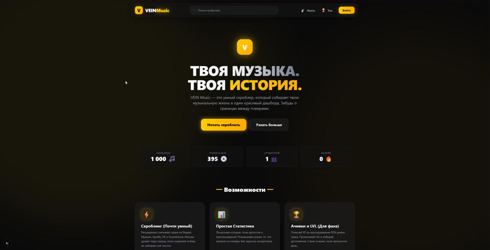

<div align="center">
  <h1>V E I N &nbsp; M U S I C &nbsp;</h1>
  
  [](https://fastapi.tiangolo.com/)
  [](https://nextjs.org/)
  []()
  []()
</div>

<br>



Система сбора музыкальной статистики и скроблинга. Проект перехватывает воспроизведение треков в браузере и агрегирует их в едином пользовательском веб-профиле.

## ⚡ Реализованные функции

* **Универсальный скроблинг**: 
  - **Extension**: Браузерное расширение для Яндекс Музыки, Spotify, VK Музыки и SoundCloud.
  - **Cloud Scrobbling**: Прямая интеграция с Spotify API и Яндекс Музыкой (работает в облаке, расширение не требуется).
* **Импорт истории**: Полная синхронизация истории прослушиваний из **Last.fm**.
* **Статистика и Уровни**:
  - Успешным прослушиванием (скроблем) считается прослушивание трека более чем на 85%.
  - За каждый скроубл начисляется 1 XP. Повышение уровней и рангов (Новичок -> Легенда).
* **Достижения**: Автоматические и ручные ачивки за цели (жанры, количество треков, ночные прослушивания).
* **Социальные функции**: Глобальный Leaderboard, система подписок, лайки и комментарии к скроублам.
* **Discord RPC**: Локальный скрипт для отображения текущего трека и уровня в статусе Discord.
* **Профиль пользователя**: 
  - Динамический UI (Color Thief) под обложку трека.
  - Настройки приватности и скрытие артистов.

## 🛠 Технологический стек

- **Backend**: FastAPI (Python), SQLAlchemy, SQLite, Pydantic v2
- **Frontend**: Next.js 14+ (React 19), Tailwind CSS 4, Framer Motion, Lucide React
- **Расширение**: Chrome Manifest V3
- **Discord RPC**: PyPresence

## 📁 Структура проекта

- `frontend/` — Веб-интерфейс.
- `music-extension/` — Код расширения.
- `main.py` — Основной сервер и Cloud-воркер.
- `discord_rpc.py` — Скрипт для Discord Rich Presence (запускается отдельно).

## 🚀 Как запустить

1. **Клон репозитория:**
   ```bash
   git clone https://github.com/Peaostrel/VEINMusic.git
   cd VEINMusic
   ```

2. **Запуск сервера и фронтенда:**
   - **Backend**: `uvicorn main:app --reload`
   - **Frontend**: `cd frontend && npm run dev`

3. **Установка расширения-скробблера:**
   - Откройте браузер на базе Chromium.
   - Перейдите в настройки расширений (`chrome://extensions/` или `edge://extensions/`).
   - Включите **Режим разработчика**.
   - Нажмите "Загрузить распакованное расширение" (Load unpacked) и выберите папку `music-extension`.
   
4. **Привязка расширения к профилю:**
   - Просто авторизуйтесь на запущенном сайте VEIN Music.
   - Расширение **полностью автоматически** обнаружит вашу сессию и подтянет ключ доступа в фоновом режиме. Никаких кнопок нажимать не нужно — скроблинг начнется моментально!
