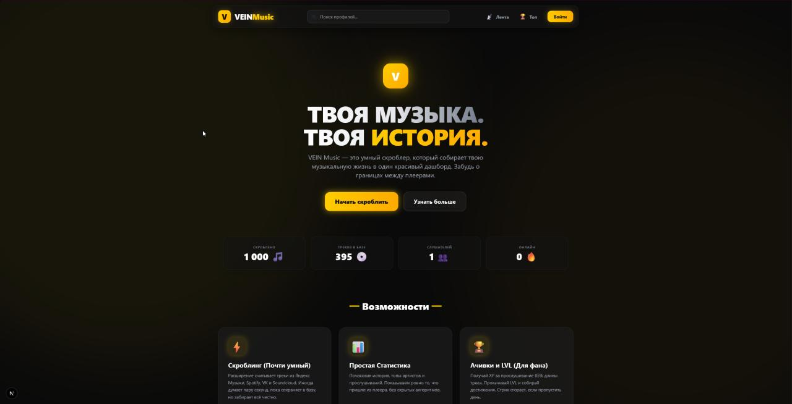

<div align="center">
  <h1>V E I N &nbsp; M U S I C &nbsp;</h1>
  
  [](https://fastapi.tiangolo.com/)
  [](https://nextjs.org/)
  [](https://www.postgresql.org/)
  []()
</div>

<br>



Система сбора музыкальной статистики и скробблинга. Проект перехватывает воспроизведение треков в браузере и агрегирует их в едином пользовательском веб-профиле.

## ⚡ Реализованные функции

* **Универсальный скробблинг**: 
  - **Браузерное расширение (Manifest V3)**: Перехват прослушиваний непосредственно с вкладок браузера для **Яндекс Музыки**, **Spotify**, **VK Музыки**, **YouTube Music**, **Apple Music** и **SoundCloud**.
  - **Облачный скробблинг (Cloud Scrobbling)**: Фоновый опрос статусов воспроизведения через официальные API платформ **Spotify** и **Яндекс Музыка** (не требует открытых вкладок).
* **Импорт истории**: Импорт архива прослушиваний из **Last.fm**.
* **Геймификация, XP и ранги**:
  - Успешным скробблом считается прослушивание трека более чем на 85% его длительности.
  - Начисление 1 XP за стандартный скроббл и 2 XP за прослушивание любимых релизов.
  - Автоматическое повышение уровней и рангов пользователя (от **Туриста** до **Божества**).
  - **Анимированные аватарные рамки**: Уникальные визуальные границы профиля, открывающиеся по достижении уровней (5+, 15+, 30+, 50+, 100+).
* **Достижения**:
  - Система наград за достижение целей (ночные прослушивания, определенные треки/артисты/альбомы, общая статистика).
  - Панель администратора для создания новых достижений и ручной выдачи наград.
* **Социальные функции**:
  - Глобальный лидерборд пользователей по количеству скробблов и уровню.
  - Подписки на пользователей, общий фид активности друзей, лайки и комментарии (с HTML-санитизацией) под скробблами.
  - Функция "Слушать вместе".
* **Профиль пользователя**: 
  - Динамическая тема оформления, адаптирующаяся под цветовую палитру обложки текущего или последнего прослушанного трека.
  - Настройки приватности истории, скрытие нежелательных артистов из фида.

## 🛠 Технологический стек

- **Backend**: FastAPI (Python), SQLAlchemy, PostgreSQL, Redis (кэширование рекомендаций и Wrapped-статистики с in-memory fallback), Pytest, Alembic
- **Frontend**: Next.js 16 (React 19), Tailwind CSS 4, Framer Motion, Lucide React, Recharts
- **Расширение**: Chrome Manifest V3 (нативный JavaScript)

## 📁 Структура проекта

- `frontend/` — Веб-интерфейс на Next.js.
- `music-extension/` — Исходный код браузерного расширения для скробблинга.
- `app/` — Исходный код бэкенда (маршрутизаторы, модели, бизнес-логика).
- `tests/` — Модульные и интеграционные тесты бэкенда (pytest).
- `main.py` — Точка входа для запуска FastAPI сервера и фоновых Cloud-воркеров.
- `docker-compose.yml` — Конфигурация для запуска баз данных PostgreSQL и Redis.

## 🚀 Как запустить

1. **Клонирование репозитория:**
   ```bash
   git clone https://github.com/Peaostrel/VEINMusic.git
   cd VEINMusic
   ```

2. **Запуск инфраструктуры (PostgreSQL & Redis):**
   Убедитесь, что у вас установлен Docker, и запустите контейнеры:
   ```bash
   docker-compose up -d
   ```

3. **Запуск бэкенда (FastAPI):**
   - Установите зависимости Python:
     ```bash
     pip install -r requirements.txt
     ```
   - Примените миграции базы данных:
     ```bash
     alembic upgrade head
     ```
   - Запустите сервер:
     ```bash
     uvicorn app.main:app --reload
     ```

4. **Запуск фронтенда (Next.js):**
   ```bash
   cd frontend
   npm install
   npm run dev
   ```

5. **Установка расширения-скробблера:**
   - Откройте Chromium-совместимый браузер (Chrome, Edge, Яндекс Браузер, Brave и др.).
   - Перейдите в раздел расширений (`chrome://extensions/`).
   - Включите **Режим разработчика** (Developer mode).
   - Нажмите "Загрузить распакованное расширение" (Load unpacked) и выберите папку `music-extension`.
   
6. **Привязка расширения к профилю:**
   - Зарегистрируйтесь и авторизуйтесь на сайте VEIN Music (`http://localhost:3000`).
   - Расширение автоматически обнаружит вашу сессию через безопасные cookie-файлы (HttpOnly). Скробблинг начнется моментально при прослушивании музыки!
